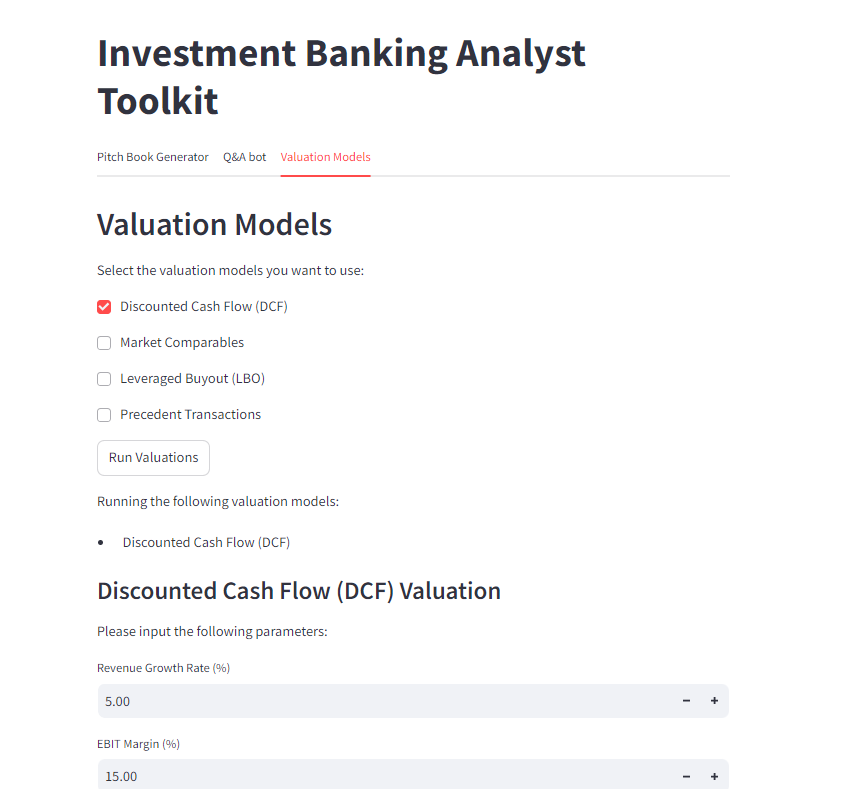

# Steps
- conda env create --file=environment_2.yml  

- Create and update the .env file
 -- AZURE_OPENAI_API_KEY = end point key
 -- AZURE_OPENAI_ENDPOINT = details of your resource
 -- AZURE_OPENAI_API_VERSION = 
 -- AZURE_OPENAI_CHAT_DEPLOYMENT = name of your llm deployement
 -- AZURE_OPENAI_EMBEDDINGS_DEPLOYMENT = name of your embedding model deployement

- streamlit run app.py

# To do
### Prompting
- Multimodel LLM provided with chart sample prompt

### Dataset 
- Add vector db
- Add connection to sql DB
- Add API endpoints for news sources
- Using these sources to fetch the data

### Deck and Charting
- Option 1 - Check the charting functionality inside generate_slide_content and enhance (Agent)
    - Variable python environment
    - Fixed Python environment
- Option 2 - Upload a ppt template and update it. 

### Chatbot 
- Reasoning with Q&A
- Agent to fetch the data from the vector DB, endpoints and sql DB

### Formula
- Upload excel file and get the formula and code

### Agent based architecture
- CrewAI

## Screenshots

#### Pitch Deck generator:

#### Valuation mode:

